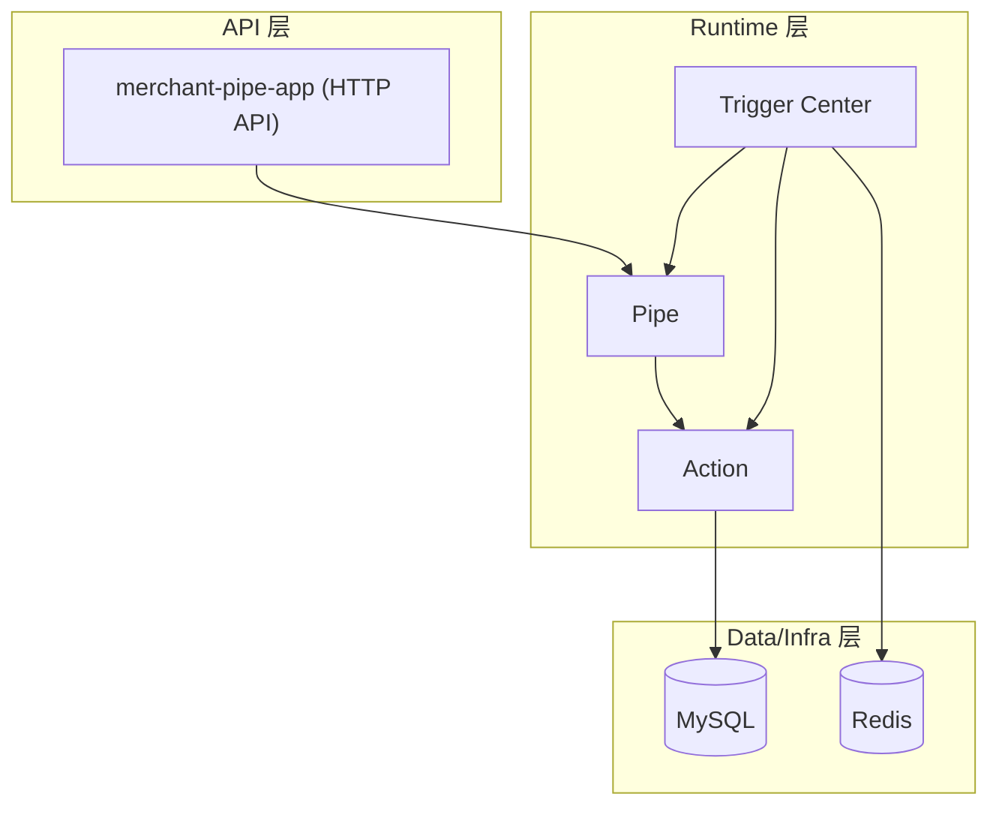
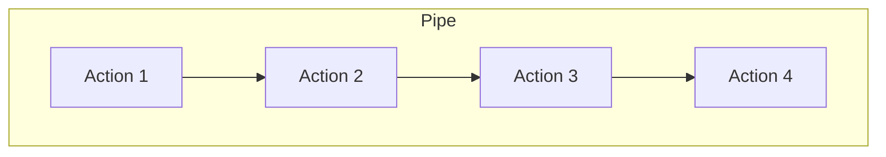

# merchant-pipe

这是一个商户同步流程的管道运行时抽象项目，目标是把“硬编码的多系统同步”沉淀成
可配置的 Action + Pipe 模型，提升其长期稳定性与可维护性。

---

---

## 模块结构
- `merchant-common`：基础工具与通用类型
- `merchant-pipe-repo`：jOOQ 生成代码（`com.merchant.pipe.db`）
- `merchant-pipe-core`：pipe/action/stage/trigger 内核
- `merchant-pipe-app`：HTTP 接口与运行容器

---

## 架构示意


---

## Pipe 结构示意


---

## 数据库
Flyway 迁移脚本在 `database/`：
- `V12.006__ACTION_PIPE.sql`
- `V12.022__PROCESS_PIPE.sql`
- `V12.100__PIPE_DEF_SIMULATE.sql`（模拟 pipe 配置）

默认库名：`merchant_pipe`

---

---

## 生成 jOOQ
jOOQ 输出在 `merchant-pipe-repo/src/main/java`：
```
./gradlew :merchant-pipe-repo:generateMainJooqSchemaSource
```

---

## 模拟 pipe（快速验证）
执行 migration 后，用脚本创建并启动一个 simulator pipe：
```
BASE_URL=http://localhost:8080 PIPE_DEF_CODE=sim_pipe npx ts-node scripts/run_sim_pipe.ts
```

---

## API
- `POST /pipes` 创建 pipe
- `POST /pipes/{pipeId}/start` 启动 pipe
- `POST /pipes/{pipeId}/start-immediately` 立即启动
- `GET /pipes/{pipeId}` 获取 pipe
- `GET /pipes/{pipeId}/actions` 获取 actions
- `GET /pipes/{pipeId}/stages` 获取 stages

---

## 目录说明
```
merchant-pipe/
├─ merchant-common                  # 通用工具与类型
├─ merchant-pipe-repo               # jOOQ 生成代码
├─ merchant-pipe-core               # pipe/action/stage/trigger 内核
├─ merchant-pipe-app                # Spring Boot HTTP 服务
├─ database                         # Flyway 迁移脚本
├─ scripts                          # 调试脚本（TS）
└─ README.md
```
